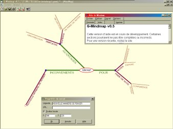



## GMindmap v0\.5

### Description

Software to make MINDMAPS. Full-working version, with full code, even for help file. Can import and export mindmaps to text files to be reimported into another mindmap software.
 
### More Info
 

             |
---                |---
**Submitted On**   |2000-08-16 20:20:36
**By**             |[C\.Dutoit](https://github.com/Planet-Source-Code/PSCIndex/blob/master/ByAuthor/c-dutoit.md)
**Level**          |Advanced
**User Rating**    |4.7 (14 globes from 3 users)
**Compatibility**  |VB 5\.0, VB 6\.0
**Category**       |[Complete Applications](https://github.com/Planet-Source-Code/PSCIndex/blob/master/ByCategory/complete-applications__1-27.md)
**World**          |[Visual Basic](https://github.com/Planet-Source-Code/PSCIndex/blob/master/ByWorld/visual-basic.md)
**Archive File**   |[CODE\_UPLOAD90128162000\.zip](https://github.com/Planet-Source-Code/c-dutoit-gmindmap-v0-5__1-10729/archive/master.zip)

